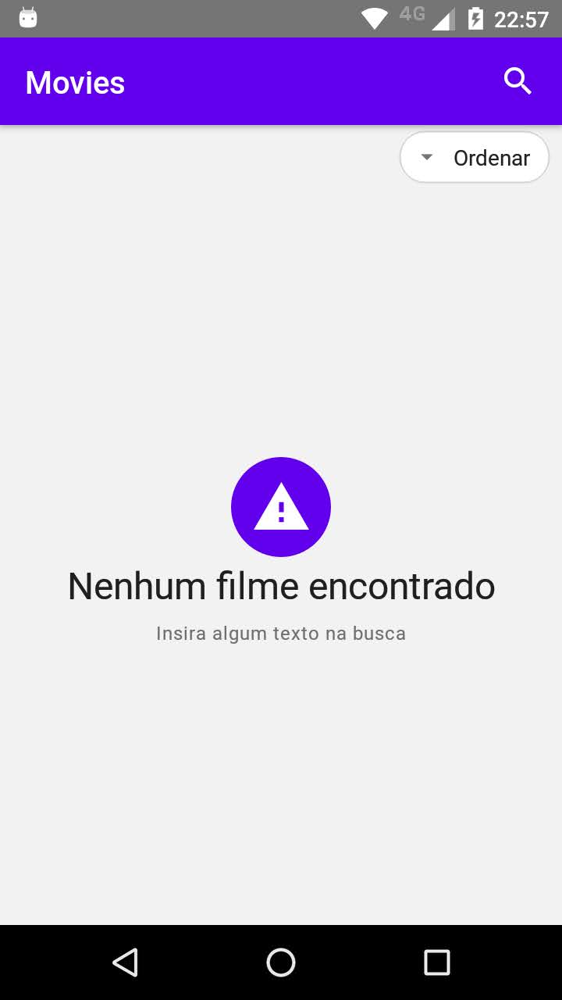
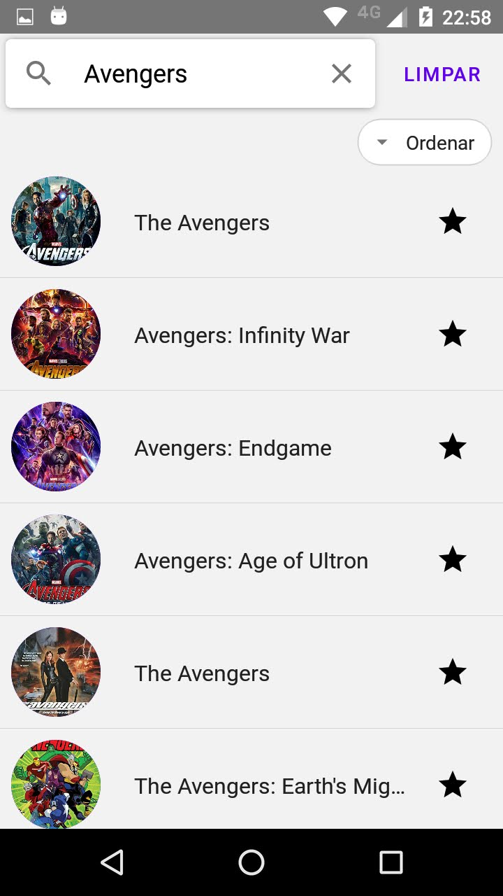
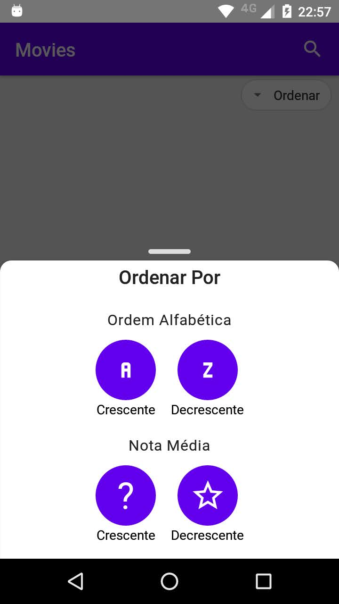
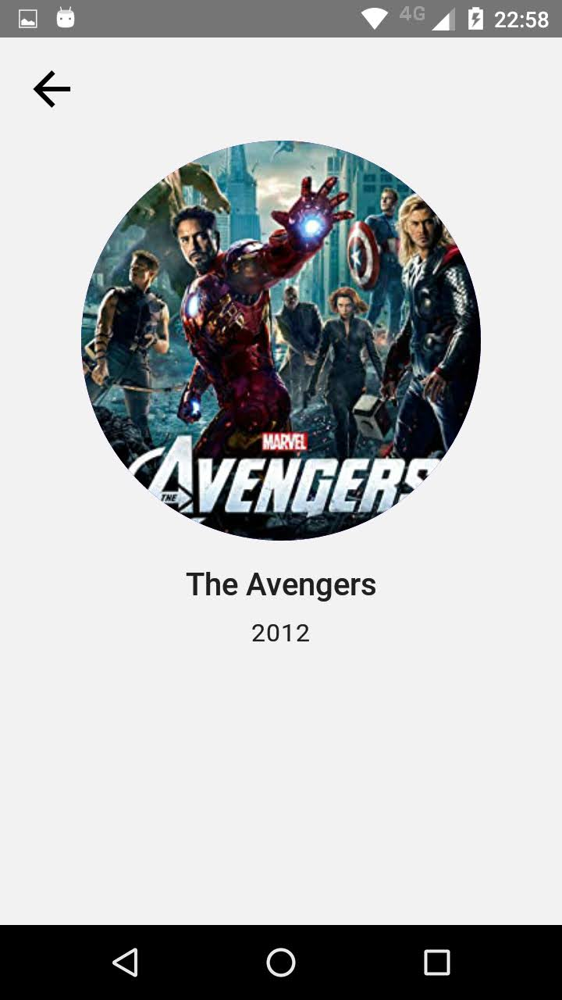

<p align="center">
  <h3 align="center">dti OMDB</h3>
</p>


<details open="open">
  <summary>Table of Contents</summary>
  <ol>
    <li>
      <a href="#about-the-project">About The Project</a>
      <ul>
        <li><a href="#built-with">Built With</a></li>
      </ul>
    </li>
    <li>
      <a href="#getting-started">Getting Started</a>
      <ul>
        <li><a href="#prerequisites">Prerequisites</a></li>
        <li><a href="#installation">Installation</a></li>
      </ul>
    </li>
    <li><a href="#resume">Resume</a></li>
    <li><a href="#contact">Contact</a></li>
  </ol>
</details>


<!-- ABOUT THE PROJECT -->
## About The Project







### Built With

* [React](https://pt-br.reactjs.org/)
* [React Native](https://reactnative.dev/)
* [React Native Paper](https://callstack.github.io/react-native-paper/)
* [Redux Toolkit](https://redux-toolkit.js.org/)
* [Redux Navigation](https://reactnavigation.org/)


## Getting Started

This is an example of how you may give instructions on setting up your project locally.
To get a local copy up and running follow these simple example steps.

### Prerequisites

* [React Native Enviroment](https://reactnative.dev/docs/environment-setup)

### Installation

1. Get a free API Key at [http://www.omdbapi.com](http://www.omdbapi.com)
2. Clone the repo
   ```sh
   git clone https://github.com/joaobenthin/dti.git
   ```
3. Install Yarn packages
   ```sh
   yarn install
   ```
4. Enter your API in `config/index.ts`
   ```JS
   const apiKey = 'ENTER YOUR API';
   ```
5. Run Bundle
   ```sh
   yarn start
   ```
5. Run Android Emulator
   ```sh
   yarn android
   ```


### Resume
Irei colocar aqui algumas observações e comentários sobre o desafio

* Resolvi utilizar o Redux Toolkit por abstrair algumas configurações do Redux puro, tentei usar o Redux Thunk mas optei pelo Redux Saga.
* Por falta de tempo decidi não utilizar a requisição onde pega os detalhes do filme e simplifiquei com apenas uma requisição.


## Contact

João Benthin - joaopaulobenthin@hotmail.com

Project Link: [https://github.com/joaobenthin/dti](https://github.com/joaobenthin/dti)
